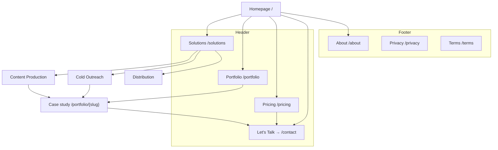

# Site Architecture — SlideIn Venture

**Site type:** Small business / agency (services)
**Depth:** 2 levels max — flat by design
**Primary goal:** Conversion (booked calls). SEO is secondary.
**Audience:** Founders who create content and need production + pipeline.

---

## Current state (audited 2026-07-31)

| Route | Status |
|-------|--------|
| `/` | Exists |
| `/solutions` | Exists |
| `/pricing` | Exists |
| `/portfolio` | **Missing — linked from header nav, 404s today** |

The `Footer` component declares **24 links; 22 resolve to nothing** (`/product/ai`,
`/product/agents`, `/product/wikis`, `/product/calendar`, `/product/projects`,
`/solutions/engineering|design|marketing|operations|hr`, `/enterprise`, `/blog`,
`/templates`, `/help`, `/community`, `/releases`, `/download`, `/about`,
`/careers`, `/security`, `/privacy`, `/terms`). These are Notion boilerplate,
not a plan. The footer is also not mounted in `app/layout.tsx`, so nothing ships
today — which is the only reason this has not been a live 404 farm.

**Rule going forward: a link ships only when its route ships.**

---

## Target hierarchy

```
Homepage (/)
├── Solutions (/solutions)
│   ├── Content Production   (/solutions/content-production)
│   ├── Cold Outreach        (/solutions/cold-outreach)
│   └── Distribution         (/solutions/distribution)
├── Portfolio (/portfolio)
│   └── Case study           (/portfolio/{slug})
├── Pricing (/pricing)
├── About (/about)
└── Contact (/contact)

Legal (footer only)
├── Privacy (/privacy)
└── Terms   (/terms)
```

Every page is within **2 clicks** of the homepage. No page needs a third level.

---

## Visual sitemap



---

## URL map

| Page | URL | Parent | Nav location | Priority | Status |
|------|-----|--------|--------------|----------|--------|
| Homepage | `/` | — | Header (logo) | High | Live |
| Solutions | `/solutions` | Home | Header | High | Live |
| Content Production | `/solutions/content-production` | Solutions | Contextual | Medium | To build |
| Cold Outreach | `/solutions/cold-outreach` | Solutions | Contextual | Medium | To build |
| Distribution | `/solutions/distribution` | Solutions | Contextual | Low | To build |
| Portfolio | `/portfolio` | Home | Header | High | **Broken link** |
| Case study | `/portfolio/{slug}` | Portfolio | Contextual | Medium | To build |
| Pricing | `/pricing` | Home | Header | High | Live |
| About | `/about` | Home | Footer | Low | To build |
| Contact | `/contact` | Home | Header CTA | High | To build |
| Privacy | `/privacy` | Home | Footer | Low | To build |
| Terms | `/terms` | Home | Footer | Low | To build |

URL conventions: lowercase, hyphenated, no trailing slash, no dates, no IDs.
The three solution slugs mirror the homepage capability labels
(`Video Production` / `Cold Outreach` / `Distribution`) so the language is
consistent from hero to leaf page.

---

## Navigation spec

**Header** — 3 items + 1 CTA, inside the 4–7 rule. No mega menu; the site is too
small to justify one, and the previous 3-column dropdown was Notion boilerplate.

```
[SlideIn Venture]   Solutions   Portfolio   Pricing        [Let's Talk →]
```

- Logo → `/`
- CTA is rightmost and is the only orange element in the bar
- Active route gets a small indicator, not a color swap
- `Portfolio` must be removed from the nav **or** `/portfolio` must ship. Do not
  leave it pointing at a 404.

**Footer** — 3 columns, only real routes:

| Services | Company | Legal |
|----------|---------|-------|
| Content Production | About | Privacy |
| Cold Outreach | Portfolio | Terms |
| Distribution | Contact | |

**Breadcrumbs** — only on `/solutions/{slug}` and `/portfolio/{slug}`:

```
Home > Solutions > Cold Outreach
Home > Portfolio > {Client}
```

---

## Internal linking plan

**Hub and spoke.** `/solutions` is the hub; the three service pages are spokes.
Each spoke links back to the hub and sideways to the other two.

| From | To | Anchor |
|------|----|--------|
| Home hero CTA | `#framework` | "The Framework" |
| Home capability labels | the 3 solution pages | "Video Production", "Cold Outreach", "Distribution" |
| Each solution page | a matching case study | "See this in production" |
| Each case study | `/pricing` then `/contact` | "What this costs" → "Start a project" |
| `/pricing` | `/contact` | "Book a call" |

Rules: no orphan pages, descriptive anchors (never "click here"), and the
highest inbound link count should belong to `/contact` — it is the conversion
endpoint.

---

## Sequenced backlog

1. **`/contact`** — the header CTA and every funnel path terminate here. Highest priority.
2. **`/portfolio`** — stops the live 404 from the header nav.
3. **Footer rewrite** — 3 real columns, mounted in `app/layout.tsx`.
4. **Three `/solutions/{slug}` pages** — the hub-and-spoke SEO surface.
5. **`/about`**, then `/privacy` + `/terms`.

No redirects are required: none of the phantom URLs were ever live, so there is
no link equity or bookmark history to preserve.
